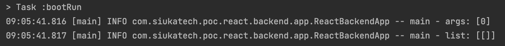
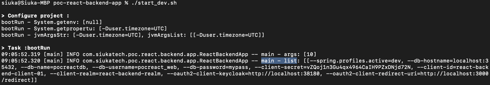
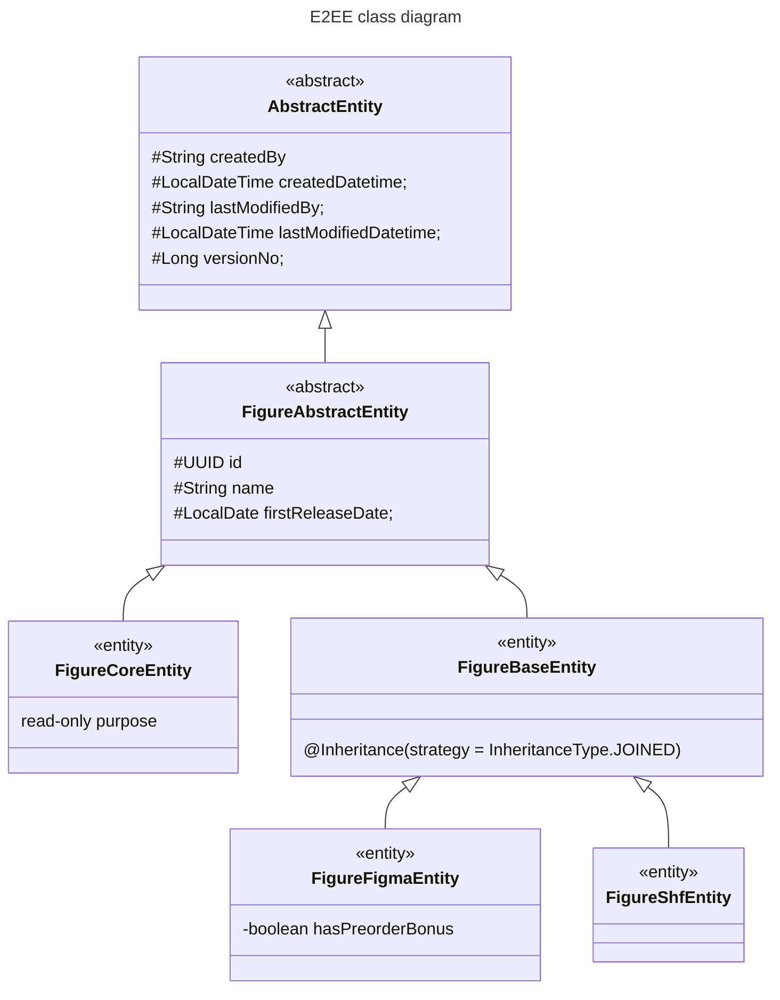

# React-Backend-App
This is the ms-project that imports the `react-backend-parent` library which mainly focusing on the business logic and flow.  
OAuth2, end-to-end-encryption and others are taking care by the `react-backend-parent` library.


# Gradle
## Setup
### Plugins
Although the dependencies are defined in `lib-project`, this project is still required the following plugins.  
```groovy
plugins {
//    id 'java'
    id 'application'
    id 'org.springframework.boot' version '3.1.0'
    id 'io.spring.dependency-management' version '1.1.0'
}
```


### Repository
The `[repository-name]` and credential information have been defined in ~/.gradle/gradle.properties.  
**Reference**  
https://docs.gradle.org/current/samples/sample_publishing_credentials.html

```groovy
repositories {
    mavenLocal()
    mavenCentral()
    if (project.hasProperty("[repository-name]Uri")) {
        maven {
            name = '[repository-name]'
            allowInsecureProtocol = true
            credentials(PasswordCredentials)
            url = uri("$[repository-name]Uri")
        }
    }
}
```


### Dependencies
As mentioned in `lib-project`, some dependencies are not required to re-define again.
```groovy
dependencies {
    implementation 'com.siukatech.poc:react-backend-parent:0.0.1-SNAPSHOT'

//	implementation 'org.projectlombok:lombok:1.18.26'
    annotationProcessor 'org.projectlombok:lombok:1.18.26'

    runtimeOnly 'org.postgresql:postgresql:42.6.0'

    testImplementation 'org.springframework.boot:spring-boot-starter-test'
    testImplementation 'org.springframework.security:spring-security-test'
    testImplementation 'com.h2database:h2:2.1.214'
}
```


## bootRun
### Intellij / Eclipse
Environment variables for bootRun   
The [redirect-uri] most likely is the frontend url, e.g. https://frontend/redirect

> spring.profiles.active=[spring-profile]  
> db-hostname=[db-hostname]  
> db-name=[db-name]  
> db-username=[db-username]  
> db-password=[db-password]  
> client-secret=[client-secret]  
> client-id=[client-id]  
> client-realm=[client-realm]  
> oauth2-client-keycloak=[keycloak-server]  
> oauth2-client-redirect-uri=[redirect-uri]


### Terminal / Command Prompt
It is weird that the behaviors between intellij bootRun task and gradlew bootRun task.  
  
  
In Intellij task, `--args` can be loaded as environment variable.  
But in gradlew task, `--args` can be loaded as class arguments only. The timezone information is required to pass through `-D`.  
```shell
#gradlew
./gradlew bootRun --debug --args='--db-hostname=[db-hostname] --db-name=[db-name] --db-username=[db-username] --db-password=[db-password] --spring.profiles.active=[spring-profile] --client-secret=[client-secret] --client-id=[client-id] --client-realm=[client-realm] --oauth2-client-keycloak=[keycloak-server] --oauth2-client-redirect-uri=[redirect-uri, most likely is frontend url, e.g. https://frontend/redirect]'  -DjvmArgs="-Duser.timezone=UTC"

#java
java -jar '-Duser.timezone=UTC' build/libs/react-backend-app-0.0.1-SNAPSHOT.jar
```


## bootJar / build
### Exclude files in bootJar
Add `bootJar` section in `build.gradle` and specify `exclude` file list.
```groovy
// '*' or '**' can be used as wildcard
bootJar {
    exclude('application*.properties', 'application*.yml')
}
```


# Design
## Package
- main/java
  - config: Application configuration
  - feature
    - business: Business services and dto
    - data: ms-project specific data layer
    - web
      - controller
        - encrypted
          - EncryptedItemController: expose protected api to encrypt
        - extended
          - AuthController: Handle OAuth2 flows
          - MyController: Expose the `my-key-info` api for decryption when calling `/encrypted` api
        - I18nController: i18n data
      - model: Form models and request models


## Annotation
By @EnableReactBackendParent in AppConfig with @Configuration.  
After the application started, those configurations will be also loaded into the ms-project.

```java
@Configuration
@EnableReactBackendParent
public class AppConfig {
    ...
}
```


## Entity Inheritance
Package is com.siukatech.poc.react.backend.app.figure.data.entity.  
- FigureAbstractEntity is the abstract class for FigureCoreEntity and FigureBaseEntity.
- FigureCoreEntity is read-only.
- FigureBaseEntity is the base for joining sub-classes by setting `@Inheritance(strategy = InheritanceType.JOINED)`.
- FigureShfEntity and FigureFigmaEntity are the actual implementations of FigureBaseEntity.

```
Visibility:
+ Public
- Private
# Protected
~ Package/Internal
```



